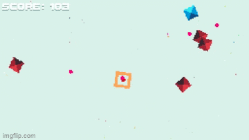

# PrismBlues

##  A top down 2D endless shooter

The game loop involves an endless number of enemies coming after you. Not only that, but you have to avoid your own shots as well! The screen wraps so that bullets can go around the screen and hit you. You can also use this to get out of sticky situations by moving to the edge and coming out on the other side.

This project taught me the fundamentals of unity and game design. I learned how to iterate the game design and techniques for good game feel. Screenshake and sound effects go along way to making the experience fun and gratifying. 
